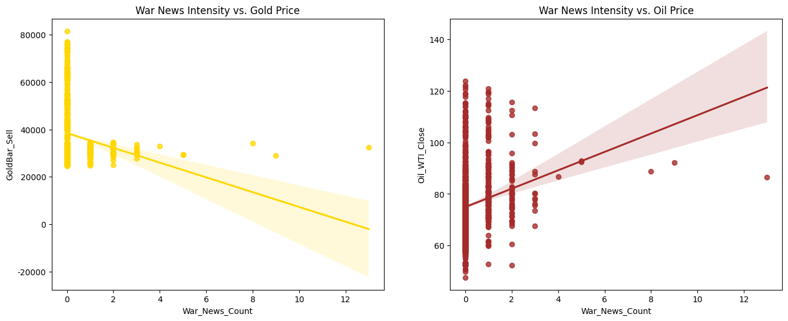

# 📊 Inter-market Relationship Analysis (Gold vs. Oil)

> 🔍 Proof-based analysis of Gold, Oil, and War News dynamics

---

## 📌 Overview

โปรเจกต์นี้เป็นการวิเคราะห์เชิงพิสูจน์ (Proof-based Analysis) เพื่อศึกษาความสัมพันธ์ระหว่าง:

- 🟡 Gold (THB)
- 🛢️ WTI Crude Oil (USD)
- 📰 War News Intensity

💡 Key Question:
> สงครามทำให้ทองและน้ำมันเคลื่อนไหวไปในทิศทางเดียวกันจริงหรือไม่?

---

## 🎯 Objectives

- 🛡️ ทดสอบทฤษฎี Safe Haven ของทองคำ
- ⚡ วิเคราะห์ความไวของราคาน้ำมันต่อข่าวสงคราม
- 🔗 ตรวจสอบความสัมพันธ์ระหว่าง Gold vs Oil

---

## 📂 Project Structure
```
📦 project-root
├── assets/
├── data/
│   ├── raw/
│   ├── processed/
│   └── LICENSE_DATA.md
│
├── src/
│   ├── crawler/
│   │   ├── gold_scraper.py
│   │   └── oil_scraper.py
│   │
│   └── processing/
│       └── data_cleaner.ipynb
│
├── main.ipynb
├── requirements.txt
├── README.md
└── LICENSE
```
---

## ⚙️ Installation
```
# 1. Clone repository
git clone https://github.com/your-username/proving-gold-oil-war-relationship.git

# 2. Enter project
cd proving-gold-oil-war-relationship

# 3. Install dependencies
pip install -r requirements.txt
```
---

## 🚀 Usage

### 1. Data Collection
- python src/crawler/gold_scraper.py
- python src/crawler/oil_scraper.py

### 2. Data Cleaning
- เปิดไฟล์ src/processing/data_cleaner.ipynb

### 3. Analysis
- เปิดไฟล์ main.ipynb

---

## 📊 Key Findings — The Proof of Reality

❌ War News Paradox

- Normal Correlation: -0.45
- War Period Correlation: ~0.03

👉 Conclusion:
Gold และ Oil “Decoupled” ในช่วงสงคราม

---

🛢️ Oil Behavior (Verified)

- Positive correlation ชัดเจน
- ข่าวเพิ่ม → ราคาน้ำมันเพิ่ม



---

🟡 Gold Behavior (Refuted)

- ไม่ได้ขึ้นตามข่าวเสมอ
- Price-in ล่วงหน้า
- มีความผันผวนสูง

---

## 📈 Dynamic Relationship

- ความสัมพันธ์ไม่คงที่ (Non-stationary)
- มีช่วง correlation สูง/ต่ำสลับกัน
- ปี 2026 มี spike ชัดเจน


---

## 🌍 Market Overview


---

## 🛠️ Tech Stack

- Python
- Pandas / NumPy
- Matplotlib / Seaborn
- Jupyter Notebook

---

## 💡 Key Insights

- War ≠ Guaranteed Gold Rally
- War news = Noise
- Gold & Oil ไม่ได้เคลื่อนที่ไปด้วยกันเสมอ
- Market behavior เป็นแบบ Dynamic

---

## 🚀 Future Work

- NLP วิเคราะห์ sentiment ข่าว
- VAR / Granger Causality
- เพิ่ม USD / Crypto

---

## 📄 License

- Code: MIT License
- Data: data/LICENSE_DATA.md

---
